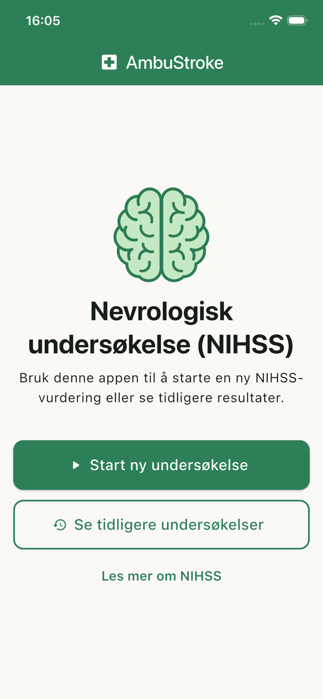
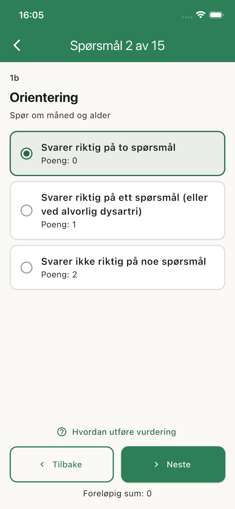
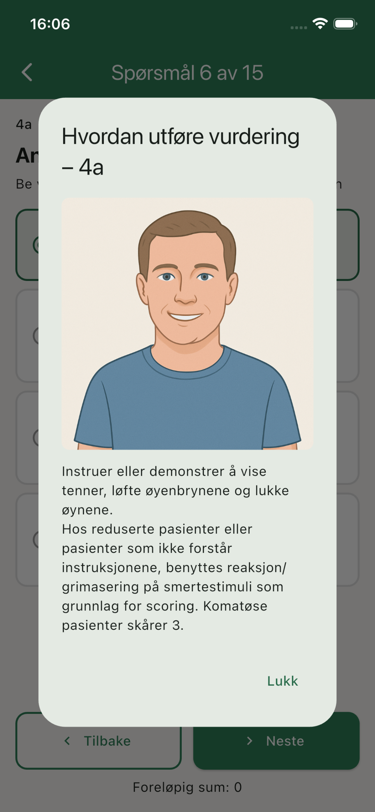
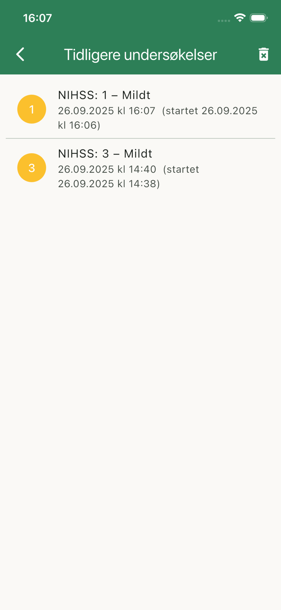

# AmbuStroke

AmbuStroke er en mobilapplikasjon for helsepersonell som benytter NIHSS-skåring i akutte situasjoner.  
Appen er utviklet for å gjøre vurderingen mer effektiv, oversiktlig og tilgjengelig – direkte på mobilen.

## Funksjoner
- Fullstendig NIHSS med enkel navigasjon
- Automatisk utregning av totalscore
- Mulighet til å korrigere enkeltpunkter underveis
- Brukervennlig grensesnitt tilpasset akutte situasjoner
- Ingen pasientdata lagres – kun totalscore lagres lokalt på enheten

## Skjermbilder
| Hjemskjerm | Skåringsspørsmål | Vurderingshjelp | Tidligere undersøkelser |
|------------|------------------|-----------------|-------------------------|
|  |  |  |  |

## Personvern
AmbuStroke lagrer ingen pasientdata. Du kan lese mer i vår [Privacy Policy](https://its-Syntax.github.io/AmbuStroke/privacy_policy.html).

---

© 2025 Marcus Evjen
